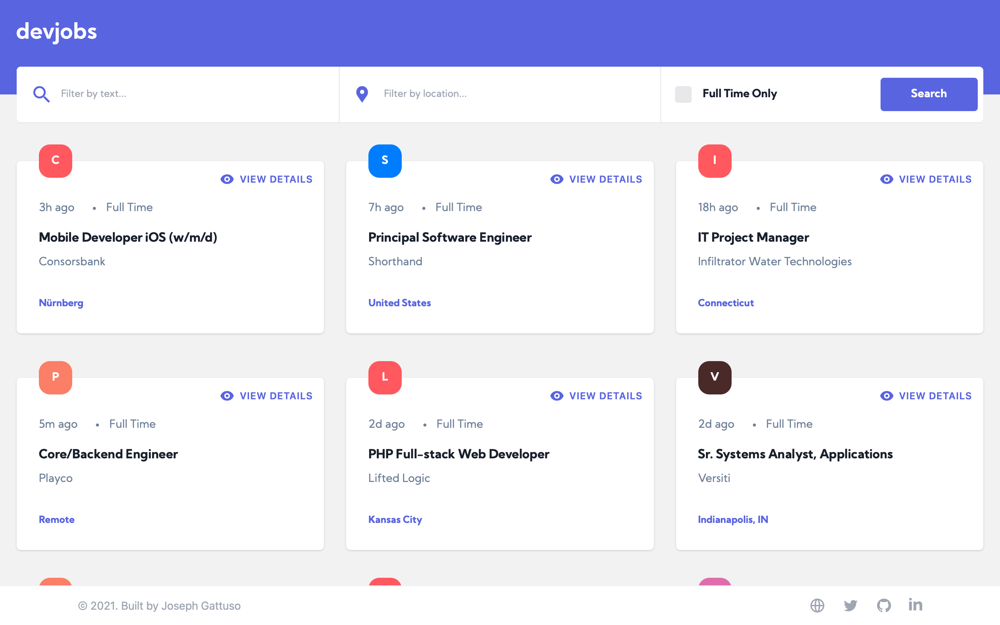

<div align='center'>
  
  <h1>
    <a
      href="https://jobs.gattuso.dev"
      rel="_blank"
      rel="noopener noreferrer nofollow"
    >
      DevJobs
    </a>
      </h1>
  <p align="center">
    Building a jobs board app using the GitHub Jobs API.
  </p>
  <p align="center">
  <a
    href="https://github.com/josephgattuso/dev-jobs/blob/master/LICENSE"
  >
    
  </a>
    <a
    href="https://github.com/josephgattuso/dev-jobs/pulls"
  >
  
  </a>
  <a
    href="https://github.com/josephgattuso/dev-jobs/commits/master"
  >
    
  </a>
  <a
    target="_blank"
    href="https://twitter.com/intent/follow?screen_name=joeetuso"
  >
    
  </a>
</p>
</div>



## 📖 User stories

- [x] View the optimal layout for each page depending on their device's screen size
- [x] See hover states for all interactive elements throughout the site
- [x] View all jobs currently live on the [GitHub Jobs API](https://jobs.github.com)
- [x] Be able to click a job from the index page so that they can read more information and apply for the job
- [x] Have the correct color scheme chosen for them based on their computer preferences. See `prefers-color-scheme` in CSS.

## 🚀 Quick Start

First, run the development server:

```sh
npm run dev
# or
yarn dev
```

Open [http://localhost:3000](http://localhost:3000) with your browser to see the result.

## 📚 Resources

- [Next.js Docs](https://nextjs.org/docs) - learn about Next.js features and API.
- [Next.js Learning](https://nextjs.org/learn) - an interactive Next.js tutorial.
- [Next.js Repo](https://github.com/vercel/next.js/) - open-source GitHub repository.
- [Next.js Deployment](https://nextjs.org/docs/deployment) - the easiest way to deploy your Next.js app
- [Vercel Platform](https://vercel.com) - from the creators of Next.js.
